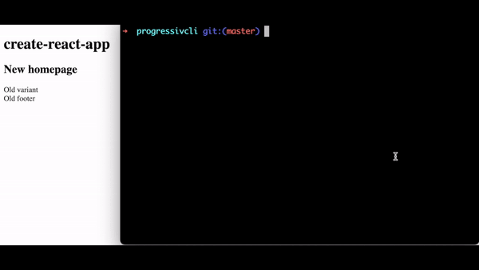

# @progressively/cli

Progressively is a simple, lightweight and OpenSource feature flag software.

This repository contains the CLI

- [x] Administrator account creation
- [x] Authentication
- [x] Project creation/deletion
- [x] Flag manipulation
- [x] Types generation

## Quickstart

```bash
npm i -g @progressively/cli
progressively duck
```

## Demo



## Summary

<!-- toc -->
* [@progressively/cli](#progressivelycli)
* [Usage](#usage)
* [Commands](#commands)
<!-- tocstop -->

# Usage

<!-- usage -->
```sh-session
$ npm install -g @progressively/cli
$ progressively COMMAND
running command...
$ progressively (--version)
@progressively/cli/1.0.0-alpha.3 darwin-arm64 node-v18.17.1
$ progressively --help [COMMAND]
USAGE
  $ progressively COMMAND
...
```
<!-- usagestop -->

# Commands

<!-- commands -->
* [`progressively config`](#progressively-config)
* [`progressively duck`](#progressively-duck)
* [`progressively env`](#progressively-env)
* [`progressively flag`](#progressively-flag)
* [`progressively help [COMMANDS]`](#progressively-help-commands)
* [`progressively login`](#progressively-login)
* [`progressively me`](#progressively-me)
* [`progressively project`](#progressively-project)
* [`progressively register`](#progressively-register)
* [`progressively types`](#progressively-types)

## `progressively config`

Configure the Progressively CLI

```
USAGE
  $ progressively config [--show]

FLAGS
  --show  Display the current configuration for the user

DESCRIPTION
  Configure the Progressively CLI

EXAMPLES
  $ progressively config
```

_See code: [src/commands/config.ts](https://github.com/progressively-crew/cli/blob/v1.0.0-alpha.3/src/commands/config.ts)_

## `progressively duck`

Try it, you won't regret it

```
USAGE
  $ progressively duck

DESCRIPTION
  Try it, you won't regret it

EXAMPLES
  $ progressively duck
```

_See code: [src/commands/duck.ts](https://github.com/progressively-crew/cli/blob/v1.0.0-alpha.3/src/commands/duck.ts)_

## `progressively env`

List the environments of the active project

```
USAGE
  $ progressively env

DESCRIPTION
  List the environments of the active project

EXAMPLES
  $ progressively env
```

_See code: [src/commands/env.ts](https://github.com/progressively-crew/cli/blob/v1.0.0-alpha.3/src/commands/env.ts)_

## `progressively flag`

Manipulate flags

```
USAGE
  $ progressively flag [-C] [--create-only]

FLAGS
  -C, --create   Create a flag and update existing
  --create-only  Only create a flag

DESCRIPTION
  Manipulate flags

EXAMPLES
  $ progressively flag
```

_See code: [src/commands/flag.ts](https://github.com/progressively-crew/cli/blob/v1.0.0-alpha.3/src/commands/flag.ts)_

## `progressively help [COMMANDS]`

Display help for progressively.

```
USAGE
  $ progressively help [COMMANDS] [-n]

ARGUMENTS
  COMMANDS  Command to show help for.

FLAGS
  -n, --nested-commands  Include all nested commands in the output.

DESCRIPTION
  Display help for progressively.
```

_See code: [@oclif/plugin-help](https://github.com/oclif/plugin-help/blob/v6.0.5/src/commands/help.ts)_

## `progressively login`

Authenticate to store tokens in config

```
USAGE
  $ progressively login

DESCRIPTION
  Authenticate to store tokens in config

EXAMPLES
  $ progressively login
```

_See code: [src/commands/login.ts](https://github.com/progressively-crew/cli/blob/v1.0.0-alpha.3/src/commands/login.ts)_

## `progressively me`

describe the command here

```
USAGE
  $ progressively me

DESCRIPTION
  describe the command here

EXAMPLES
  $ progressively me
```

_See code: [src/commands/me.ts](https://github.com/progressively-crew/cli/blob/v1.0.0-alpha.3/src/commands/me.ts)_

## `progressively project`

describe the command here

```
USAGE
  $ progressively project [-C] [-D]

FLAGS
  -C, --create  Create a project before selection
  -D, --delete  Delete a project

DESCRIPTION
  describe the command here

EXAMPLES
  $ progressively project
```

_See code: [src/commands/project.ts](https://github.com/progressively-crew/cli/blob/v1.0.0-alpha.3/src/commands/project.ts)_

## `progressively register`

Register an admin user

```
USAGE
  $ progressively register

DESCRIPTION
  Register an admin user

EXAMPLES
  $ progressively register
```

_See code: [src/commands/register.ts](https://github.com/progressively-crew/cli/blob/v1.0.0-alpha.3/src/commands/register.ts)_

## `progressively types`

Generate types based on your Progressively instance

```
USAGE
  $ progressively types

DESCRIPTION
  Generate types based on your Progressively instance

EXAMPLES
  $ progressively types
```

_See code: [src/commands/types.ts](https://github.com/progressively-crew/cli/blob/v1.0.0-alpha.3/src/commands/types.ts)_
<!-- commandsstop -->
